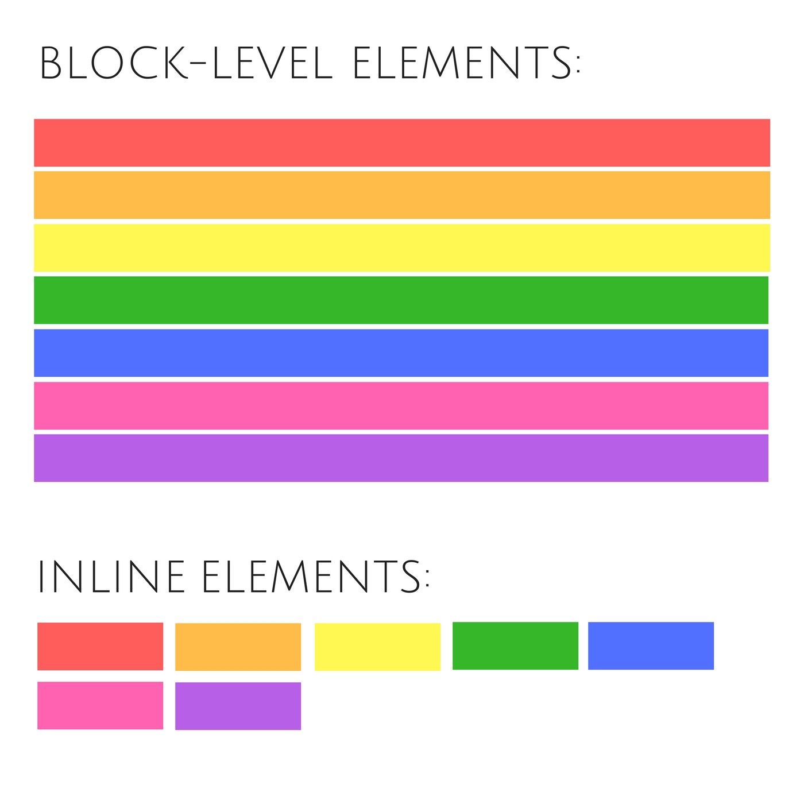
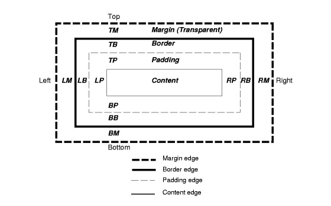

## HTML Element Tags
* An HTML element usually consists of a start tag and an end tag, with the content inserted in between:

```html
<tagname>Content goes here...</tagname>
```
Basics: 
* The `<html>` element defines the whole document.

* It has a start tag `<html>` and an end tag `</html>`.

* Inside the `<html>` element is the `<body>` element.

* The `<body>` element defines the document body.

&nbsp;    
## HTML Attributes:

* All HTML elements can have attributes
* Attributes provide additional information about an element
* Attributes are always specified in the `<start>` tag, not the closing `</end>` tag 
* Attributes usually come in `name/value pairs` like: `name="value"`

&nbsp;  

* The `title` attribute provides additional "tool-tip" information
* The `href` attribute provides address information for links
* The `width` and `height` attributes provide size information for images
* The `alt` attribute provides text for screen readers

&nbsp;   
## Block vs Inline vs Inline-Block Elements:

### Block:
* Block elements are usually container elements, like `<div>`, `<section>`, and `<ul>`. Also text "blocks" like `<p>` and `<h1>`. Block level elements do not sit inline but break past them. By default (without setting a width) they take up as much horizontal space as they can.

* A block-level element always starts on a new line and takes up the full width of a page, from left to right. A block-level element can take up one line or multiple lines and has a line break before and after the element.


### Inline:
* An `inline` element will accept margin and padding, Margin and padding will only push other elements horizontally away, not vertically. `An inline element will not accept height and width.` It will just ignore it.

### Inline-Block:
* An element set to `inline-block` is very similar to inline in that it will set inline with the natural flow of text (on the "baseline"). `The difference is that you are able to set a width and height which will be respected.`

&nbsp;   
<p align="center">
  
</p>

#### Block level elements in HTML:

  HTML     | Block |  Level | Elements
---------- | ---------- | ---------- | ----------
`<address>` | `<article>` | `<aside>` | `<blockquote>`
`<canvas>` | `<dd>` | `<div>` | `<dl>` 
`<dt>` | `<fieldset>` | `<figcaption>` | `<footer>` 
`<form>` | `<h1>` - `<h6>` | `<header>` | `<hr>`
`<li>` | `<main>` | `<nav>`  | `<noscript>` 
`<ol>` | `<p>`  | `<pre>` | `<section>` 
`<table>` | `<tfoot>` | `<ul>` | `<video>`


<!-- ```html
  <address> * <article> * <aside> * <blockquote> * <canvas> * <dd> * <div> * <dl> * <dt> * <fieldset> * <figcaption> * <figure> * <footer> * <form> * <h1> - <h6> * <header> * <hr> * <li> * <main> * <nav> * <noscript> * <ol> * <p> * <pre> * <section> * <table> * <tfoot> * <ul> * <video>
``` -->

<!-- * `<address>`
* `<article>` 
* `<aside>` 
* `<blockquote>` 
* `<canvas>` 
* `<dd>` 
* `<div>` 
* `<dl>` 
* `<dt>` 
* `<fieldset>` 
* `<figcaption>` 
* `<figure>` 
* `<footer>` 
* `<form>` 
* `<h1>` - `<h6>` 
* `<header>` 
* `<hr>` 
* `<li>` 
* `<main>` 
* `<nav>` 
* `<noscript>` 
* `<ol>` 
* `<p>` 
* `<pre>` 
* `<section>` 
* `<table>` 
* `<tfoot>` 
* `<ul>` 
* `<video>` -->


&nbsp;    
#### Inline elements in HTML:
<!-- ```html
<a> * <abbr> * <acronym> * <b> * <bdo> * <big> * <br> * <button> * <cite> * <code> * <dfn> * <em> * <i> *  * <input> * <kbd> * <label> * <map> * <object> * <output> * <q> * <samp> * <script> * <select> * <small> * <span> * <strong> * <sub> * <sup> * <textarea> * <time> * <tt> * <var>
``` -->

| HTML | Inline      |  Level | Elements 
| ---- | ----------- | -------- | ---------
`<a>`  |`<abbr>`  |`<acronym>`  | `<b>`
`<bdo>`  |`<big>`  | `<br>`  |`<button>`  
`<cite>` | `<code>`  |`<dfn>`  |`<em>`
`<i>` | ``  |`<input>` | `<kbd>`
`<label>` | `<map>`  | `<object>`  |`<output>`  
`<q>` | `<samp>`  |`<script>` | `<select>` 
`<small>` | `<span>` | `<strong>`  | `<sub>`  
`<sup>` | `<textarea>` | `<time>` | `<tt>` 
 `<var>`

&nbsp; 


## CSS Selectors

* `type` selectors – matching a specific element
* `class` selectors – matching elements with a specific class
* `ID` selectors – matching the element with a specific ID
* `descendant` selectors – matching elements that are descendants of a specific element
* `child` selectors – matching elements that are a child of the specific element
* `universal` selectors – matching any element
* `adjacent sibling` selectors – matching elements immediately preceded by a specific element
* `attribute` selectors – matching elements with a specific attribute or attribute value
* `pseudo-class` selectors – matching elements with a specific pseudo-class
* `pseudo-element` selectors – matching elements with specific pseudo-element properties

&nbsp;    
### When choosing between a CSS ID and a CSS class, follow the convention:

* Classes (.classname) are used if the same style will be used on multiple HTML elements.

* IDs (#idname) are used if a style is unique to a certain HTML element.

&nbsp;   
## Adding CSS styling to HTML

`Inline` - by using the style attribute in HTML elements

> Adding inline styles:
```html
<div style="CSS_PROPERTY: VALUE">
  <!-- container content -->
</div>
```
&nbsp;    

`Internal` - by using a `<style>` element in the `<head>` section

> Adding a Stylesheet in the HTML file:
```html
<head>
  <style type="text/css"> 
    /* your CSS Styles */
  </style>
</head>
```

&nbsp;    
`External` - by using an external CSS file
> Linking a stylesheet:
```html
<link rel="stylesheet" type="text/css" href="./styles"/> 
```

&nbsp;   
## CSS Box Model:

### The model helps to understand the relationship between `margin`, `padding`, `border`, the `width` and the `height` of the elements.

* Content: The text, image, icon etc... contained by the html element
* Margin: It lies outside the box and is basically used to separate itself from other markup elements.
* Border: It is the border of our box, that also lies outside but before margin.
* Padding: Lies inside of the box, creates inner space in the box when used. It lies after the border.


&nbsp;   
The following figure illustrates the box model:

<p align="center">
  
</p>
&nbsp; 

## Calculating net height & width of the box:

#### Margin, border and padding – altogether make the overall width and height of our box:

* Width + Left margin + Right margin + Left border + Right border + Right padding + Left padding

#### The height of the box can be calculated using this way:

* Height + Top margin + Bottom margin + Top border + Bottom border + Top padding + Bottom padding

&nbsp;   
## Box Sizing:

Syntax: box-sizing: content-box|border-box|initial|inherit;

* Content-Box: Default. The width and height properties (and min/max properties) includes only the content. Border and padding are not included

* Border-Box: The width and height properties (and min/max properties) includes content, padding and border

```css
body {
    box-sizing: border-box;
}
```

&nbsp;    
## CSS Pseudo-Classes

* Pseudo class selectors are CSS selectors with a colon preceding them.

```css
a:hover {
  color: purple;
}
```

* `:hover`
* `:active`
* `:visited`
* `:focus`
* `::before` - Add content before a certain element.

* `::after` - Add content after a certain element. Commonly for the `clearfix`, ** Where an empty space is added after the element which clears the float without any need for extra HTML markup. **


&nbsp;    
## Layout and Positioning in CSS

#### The `position` property specifies the type of positioning method used for an element


```css
div {
  position: static | relative | absolute | fixed | sticky;
}
```

* Static - Default value. Elements render in order, as they appear in the document flow

* Absolute - The element is positioned `relative` to its first positioned (not static) ancestor/`parent element`

* Fixed - The element is positioned `relative` to the `browser window`

* Relative - The element is positioned relative to its normal position

* Sticky - A newly added CSS property, The element is positioned based on the user's scroll position


&nbsp;

## CSS Media Queries

### Media queries can be used to check many things, such as:

* width and height of the viewport
* width and height of the device
* orientation (is the tablet/phone in landscape or portrait mode?)
* resolution

&nbsp;

#### Using media queries are a popular technique for delivering a tailored style sheet to desktops, laptops, tablets, and mobile phones


Syntax:
* A media query consists of a `media type` and can contain `one or more expressions`, which resolve to either `true` or `false`.

```css
@media not|only mediatype and (expressions) {
  CSS-Code;
}
```

&nbsp;
Example:
```css
@media screen and (min-width: 480px) {
  body {
    background-color: lightgreen;
  }
}
```
&nbsp;


### This allows us to control what `styles` get applied to the encompassed elements at the specified `screen size` (or `expression`):
```css
/* On screens that are 992px wide or less, go from four columns to two columns */
@media screen and (max-width: 992px) {
  .column {
    width: 50%;
  }
}

/* On screens that are 600px wide or less, make the columns stack on top of each other instead of next to each other */
@media screen and (max-width: 600px) {
  .column {
    width: 100%;
  }
}
```

&nbsp;   
### Common Screen Size and Breakpoints
```css
/* /* Extra small devices (phones, 600px and down) */
@media only screen and (max-width: 600px) {...}

/* /* Small devices (portrait tablets and large phones, 600px and up) */
@media only screen and (min-width: 600px) {...}

/* /* Medium devices (landscape tablets, 768px and up) */ 
@media only screen and (min-width: 768px) {...}

/* /* Large devices (laptops/desktops, 992px and up) */ 
@media only screen and (min-width: 992px) {...}

/* Extra large devices (large laptops and desktops, 1200px and up)  */
@media only screen and (min-width: 1200px) {...}
```


# 

## Resources

* https://w3bits.com/css-box-model/
* https://w3bits.com/box-sizing-reset/
* https://css-tricks.com/pseudo-class-selectors/
