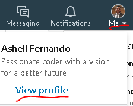
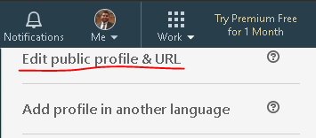
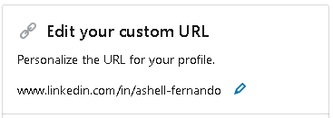

# How to change your default LinkedIn URL to a custom URL

## Why would you want to?

### It's simple, you're networking with somebody and they ask for your LinkedIn. By changing to a URL that is more digestible, both parties will be able to quickly find and add each other.

## Instructions

1. Log into LinkedIn [https://linkedin.com](https://linkedin.com)
1. Click on `Me` on top of the navbar and then click on `View Profile`
    - 
1. On top right corner, click on `Edit public profile & URL`
    - 
1. Again on the same place, you should see an edit icon next to your default url

    - 

## After saving it, you should be able to access your profile with the custom URL you set :)
