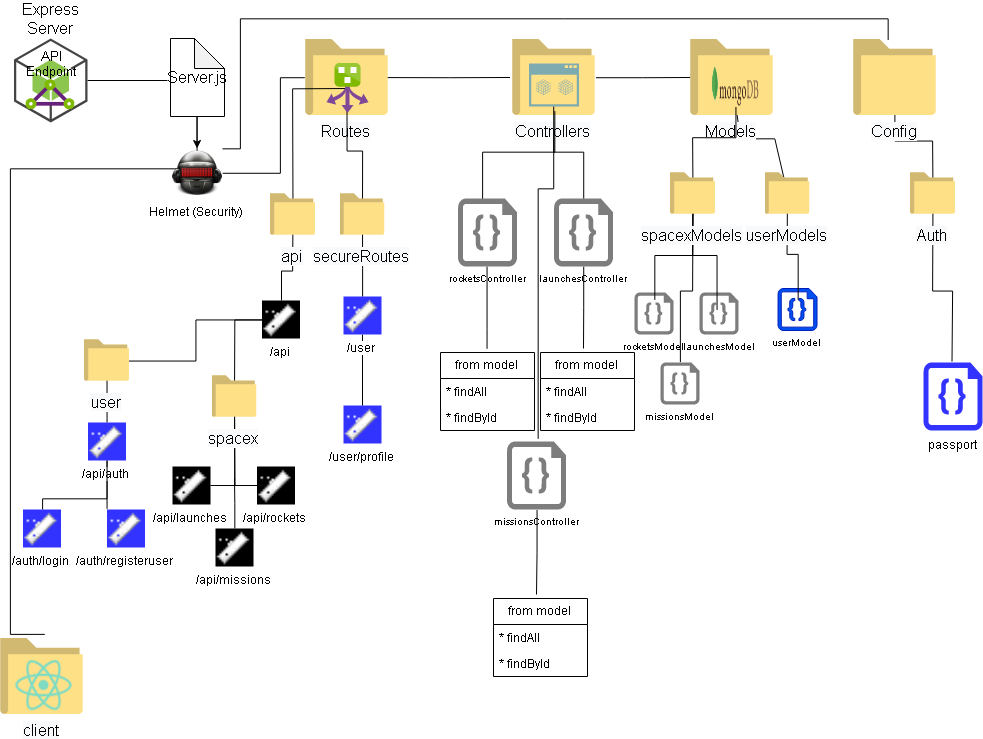

# Rocketsite

### A fullstack MERN app to display data from SpaceX API

## API

### This app is made with [SpaceX's FREE PUBLIC API](https://docs.spacexdata.com/?version=latest#intro). You don't need an API key because it's public data.

## How to install

```
1. run `git clone git@github.com:ehoversten/Teaching_Review.git`

2. cd `Teaching_Review/MERN-stack`

3. install the packages using NPM. Run `npm install`

4. Create a `.env` file in the server root folder with `JWT_SECRETKEY=uniqueKeyForPasswordEncryption` inside

5. Run the watch command, `npm run watch`

```

## Wireframe

### Express



## Routes

### EXPRESS API ENDPOINT: The url for your Express API endpoint is `http://localhost:3001`.

-   `/api` ex: http://localhost:3001/api

    -   GET `/api` - res.json({msg:'ok root'})

    <!-- /api/rockets, /api/launches, etc. -->

    -   `/rockets` ex: http://localhost:3001/api/rockets

        -   GET `/:rocket_id`- displays rocket info for specified ID via query: rocket_id
        -   GET `/` - displays all launches

    -   `/launches` ex: http://localhost:3001/api/launches

        -   GET `/:flight_number` - displays launch info for specified ID via query: flight_number
        -   GET `/` - displays all launches

    -   `/missions` ex: http://localhost:3001/api/missions

        -   GET `/:mission_id` - displays mission info for specified ID via query: mission_id
        -   GET `/` - displays all mission

    -   `/auth` ex: http://localhost:3001/api/auth
        -   POST `/registeruser` - pass in body an object of `{ "username":"yourUserName", "password":"yourPassword" }`
        -   POST `/login` - pass in body an object of `{ "username":"yourUserName", "password":"yourPassword" }`. **You will get a JWT(JSON Web Token) named `token` if successful.**

-   `/user` ex: http://localhost:3001/user
    -   `/profile` ex: http://localhost:3001/user/profile
        -   GET `?t=` - **THIS PATH WON'T GIVE INFO WITHOUT A TIME VALID `?t=` JWT string!**
            <!--
            EX:
             localhost:3001/user/profile?t=eyJhbGciOiJIUzI1NiIsInR5cCI6IkpXVCJ9..etc-->

## Technologies Used

### EXPRESS API ENDPOINT:

| Technology         | Description                                                                         |
| ------------------ | ----------------------------------------------------------------------------------- |
| axios              | To make HTTP requests                                                               |
| bcryptjs           | To Encrypt passwords before saving to database                                      |
| body-parser        | Parses data and replace the `req.body` with new data                                |
| dotenv             | Allows us to use emulate hosting environment by using `.env` file                   |
| express            | For the API Endpoint                                                                |
| helmet             | For extra HTTP security                                                             |
| if-env             | Allows for multiple scenarios of `npm start`, in our case.                          |
| jsonwebtoken       | Sign & Verify JWT                                                                   |
| mongoose           | Connection to MongoDB                                                               |
| passport           | Authentication                                                                      |
| passport-jwt       | Authentication using JWT strategy                                                   |
| passport-local     | Authentication using local username:password strategy                               |
| _DEV_ concurrently | _DEV ENV ONLY_ runs both express endpoint AND react frontend servers _concurrently_ |
| _DEV_ morgan       | _DEV ENV ONLY_ logs http into console for debug purposes                            |
