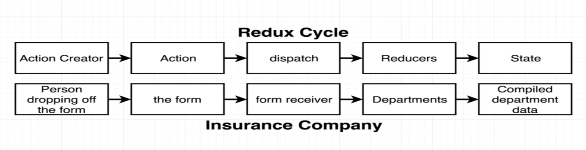
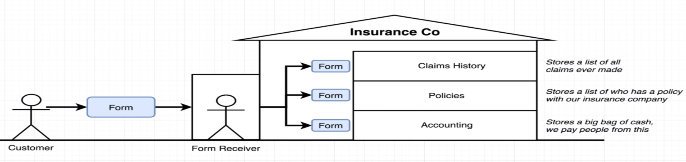
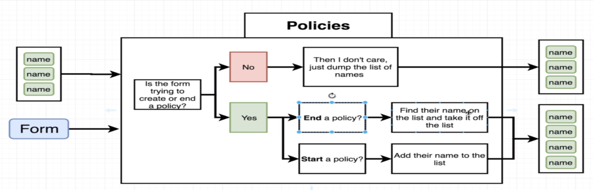

# Action Creators

```javascript
//People dropping off a form (Action Creators)
const createPolicy = (name, amount) => {
    return {
        //Action (a form in the analogy)
        type: 'CREATE_POLICY',
        payload: {
            name: name,
            amount: amount
        }
    };
};

const deletePolicy = name => {
    return {
        type: 'DELETE_POLICY',
        payload: {
            name: name
        }
    };
};

const createClaim = (name, amountOfMoneyToCollect) => {
    return {
        type: 'CREATE_CLAIM',
        payload: {
            name: name,
            amountOfMoneyToCollect: amountOfMoneyToCollect
        }
    };
};
```

# Reducers (Departments!)

```javascript
const claimsHistory = (oldListOfClaims = [], action) => {
    //place to get the action.type
    //return a NEW array with action.payload added, original array is NOT mutated like it will with oldListOfClaims.push()
    if (action.type === 'CREATE_CLAIM') {
        return [...oldListOfClaims, action.payload];
    }

    //return the unaltered oldListOfClaims if none of action.types don't match
    return oldListOfClaims;
};

const accounting = (bagOfMoney = 100, action) => {
    if (action.type === 'CREATE_CLAIM') {
        return bagOfMoney - action.payload.amountOfMoneyToCollect;
    } else if (action.type === 'CREATE_POLICY') {
        return bagOfMoney + action.payload.amount;
    }

    return bagOfMoney;
};

const policies = (listOfPolicies = [], action) => {
    if (action.type === 'CREATE_POLICY') {
        return [...listOfPolicies, action.payload.name];
    } else if (action.type === 'DELETE_POLICY') {
        //.filter() uses a callback function to iterate through each element of the array and return a NEW array with conditionals done inside.
        return listOfPolicies.filter(name => name !== action.payload.name);
    }

    return listOfPolicies;
};
```

# Store - The assembly of different `Reducers` and `Action Creators`

```javascript
import { createStore, combineReducers } from 'redux';

import { claimsHistory, accounting, policies } from './departmentReducers';

const ourDepartments = combineReducers({
    claimsHistory: claimsHistory,
    accounting: accounting,
    policies: policies
});

const store = createStore(ourDepartments);

const action = createPolicy('ash', 100);

store.dispatch(action);

console.log(store.getState());

/* this is what it would show
{
    accounting: 200,
    claimsHistory: [],
    policies:[
        0: "ash"
    ]
}
 */
```

# More Redux info is available here: [REACT-REDUX.md](./REACT-REDUX.md)
