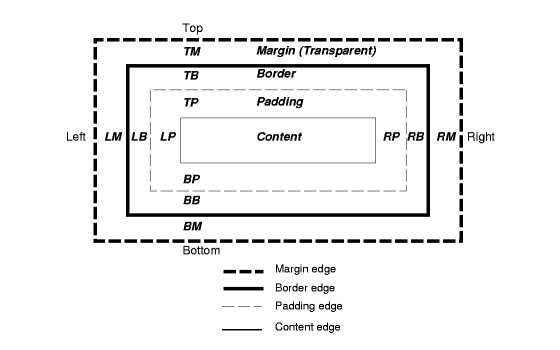

# What is Bootstrap and why would we choose to use it?

### Bootstrap is a popular front-end component library. Bootstrap is an open source toolkit for developing with HTML, CSS, and JS

&nbsp; 
## Advantages:
* Browser Compatibility   (Link to compatible browsers)
* Fast Development and Prototyping
* Useful for developers without strong design skills
* Easy to Learn
* Responsive Layouts 

&nbsp; 
## Installation:
* Include the CDN (Content Delivery Network) Link
* Download and Include (* if you don't have internet or working offline)
* Package Managers (NPM, Yarn)

&nbsp; 
## UI Utilities and Classes
* Grid System - FLEXBOX
* Text and Typography
* Positioning
* Spacing
* Sizing
* Align Content
* Colors
* Images
* Responsive Utilities (Mobile First)
* and more ...

&nbsp; 
## CSS Components
* Forms and Input Groups
* Tables
* List Groups
* Cards
* Progress Bars
* Alerts
* Navbars and Menus
* Buttons and Button Groups
* Pagination
* Media Objects
* Jumbotron
* Badges

&nbsp; 
## Javascript Widgets
* Carosel Slider
* Collapsible Accordian
* Modals
* Tooltips
* Popovers
* ScrollSpy 

&nbsp; 
## What do we need to start?
* Your favorite IDE (VScode, Atom, Sublime)
* Live Server Extension (Recommended)
* Emmet Extension (Recommended)
* An HTML file to code in (usually `index.html`)
&nbsp; 
#
* ## Containers
* ## Rows
* ## Columns / Grid / Flexbox
* ## Cards
* ## Navigation
* ## Jumbotron
* ## Adding JavaScript & Script files
* ## Modals
* ## Scrollspy

* # Box-Sizing ** 

The CSS box model acts as a `container` which has the ability to modify properties including `borders`, `margin`, `padding` and the `content` itself. It is helpful to create the design and layout of web pages. The web browser renders every element as a rectangular box according to the CSS box model. The Box-Model has multiple properties in CSS. 

Some of them are as follows:

* Borders
* Margins
* Padding
* Content

The following figure illustrates the box model:

  

* ## Responsive Styling with CSS Media-Queries

## Resources:

FlexBox:
* https://css-tricks.com/snippets/css/a-guide-to-flexbox/#flexbox-background

CSS-Grid:
* https://css-tricks.com/snippets/css/complete-guide-grid/