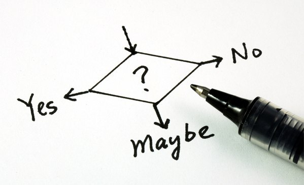

# Conditionals in JavaScript

### In computer science, conditional statements, conditional expressions and conditional constructs are features of a programming language, which perform different computations or actions depending on whether a programmer-specified boolean condition evaluates to true or false.

&nbsp;

<!--  -->



&nbsp; 
&nbsp; 

## if... else Statements:
- The most common type of conditional statement you'll use in JavaScript 


```javascript
if (test_condition) {
  // code to run if test_condition is true
} else {
  // run some other code instead
}
```

&nbsp; 

## else / if Statements:
- Typically used when we have more than two options of how we would like the logic of the code to perform.
- This way we can chain on extra choices/outcomes

```javascript
if (test_condition) {
  // code to run if test_condition is true
} else if (another_test_condition){
  // run some code if 'another_test_condition' evaluates to TRUE
} else if (third_test_condition) {
  // run some code if 'third_test_condition' evaluates to TRUE
} else {
  // run the code here if none of the conditions evaluate to TRUE
}
```

#


## Using Logical Operators with Conditional Statements: 
* && — AND; allows you to chain together two or more expressions so that all of them have to individually evaluate to true for the whole expression to return true.

* || — OR; allows you to chain together two or more expressions so that one or more of them have to individually evaluate to true for the whole expression to return true.

&nbsp; 
```javascript
if (test_condition_1 && test_condition_2 ) {
  // code that runs when BOTH condition_1 and condition_2 evaluate to TRUE
} else {
  // code that runs when either one or both test_conditions evaluate to FALSE
}
```
&nbsp; 

## The Switch Statement:
###  A `switch` statement single expression/value as an input, and then look through a number of choices until they find one that matches that value, executing the corresponding code that goes along with it.

&nbsp;
```javascript
switch (expression) {
  case choice1:
    // run this code
    break;  // <- Don't forget the `break` statement at the end of each CASE

  case choice2:
    // run this code 
    break;

  case choice2:
    // run this code 
    break;

  // In the instance that no conditions match the passed in expression we need a `default` case that runs.
  default:
    // No Match? Run this code
}
```
&nbsp; 

## Ternary operator: 

### The ternary or conditional operator is a small bit of syntax that tests a condition and returns one value/expression if it is true, and another if it is false

```javascript
( test_condition ) ? IF TRUE -> run this code : IF FALSE -> run this code instead

// -- EXAMPLE --
let num = 5
let result = (num < 10) ? console.log("TRUE") : console.log("FALSE");  
```

#
&nbsp;


#
### RESOURCES - https://developer.mozilla.org/en-US/docs/Learn/JavaScript/Building_blocks/conditionals