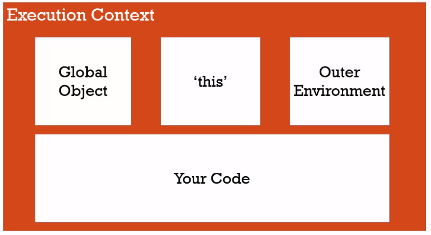

# Global Environment and Global Object

### Whenever code is run in JS, it's run inside an execution context. This means that the JS engine (i.e. the program that other people wrote that's parsing, looking at, and verifying and executing your code) wraps the currently executing code.

### Normally, there is more than one execution context during a JS program. The base execution context is your global execution context, and it has a couple of special features that come along for the ride.

### The base execution context is **_the global execution context_**. By `global`, we mean that everything has access to it everywhere.


## The global execution context creates two things for you, which you don't have to code.

-   ### It creates a `Global Object` (a collection of name/value pairs).
-   ### It creates a special variable for you, called `this`.


### TA: demonstration

1. Open up a blank web page -> open chrome devTools
1. Type `this`
    - The execution context was created by the JS engine (V8) and it decided what the value of `this` should be and what `this` is, in the browser window.
1. Type `window`
    - The window object is the global object inside browsers.
    - The global object is different for Node.JS. It isn't the window object; it's a different global object.
    - There is **_always_** a global object when you're running JS.
1. Open a different tab and type `this` again
    - Each separate tab is a different global object.
    - Each window has its own execution context and its own global execution context.


#### Code:

1. Open a new tab and paste the code below
1. Explain what's going on and how to execute `b`

```javascript
var a = 'sup';

function b(oneParameter) {
    console.log(oneParameter);
    return oneParameter + ' b';
}
```

## **Outer Environment** - //this will be done once we get into running and executing functions, part deux :)

### When you're running code inside a function, `Outer Environment` means the code that's outside the function. But when you're running at the global level, meaning when you're not inside a function, there's nothing outside (you're already as outside as you can get). There is no outer environment, so the outer environment is just null (it's nothing at the global level).


## Your Code

### And finally, the execution context is running your code!



# The wrapper, or the `execution context`, has other things that you didn't write. And the JS engine running your code is doing it for you!
