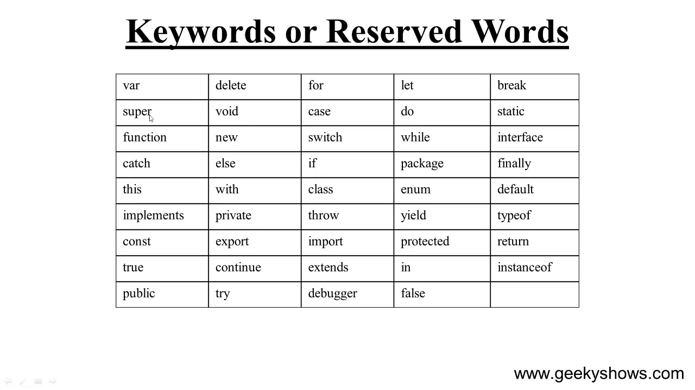

# What are Variables?

### Variables can be thought of as named containers. You can place data into these containers and then refer to the data simply by naming the container.


### Before you use a variable in a JavaScript program, you must declare it. Variables are declared with the `var` keyword.

&nbsp; 
## JavaScript Variable naming conventions:

* ### Contain `letters`, `numbers`, `$`, or `_`
* ### Begin with `letter`, or `_`
* ### Variable names are case-sensitive.
* ### Avoid `RESERVED` words

&nbsp; 

## Declaring Variables:

```javascript
var variableName = value;

var firstName = 'Kire';
var lastName = 'Bobbins';
var age = 45;
```

Or we could declare variables this way...
```javascript
// here we can declare multiple variables in one line
var firstName, lastName, age;

// but we still have to assign values
firstName = 'Bob';
lastName = 'the Builder';
age = 45;

```
Or this way...
```javascript
var firstName = "Ricki", 
    lastName = "Lake", 
    age = 35;
```

&nbsp; 


## Variables can be assigned any data type:

* ### A String or a string of characters
```javascript
var userName = 'Jane Doe';
```
* ### An Integer or Floating Point Number
```javascript
var userAge = 30;
```
* ### A Boolean `true` or `false`
```javascript
var catsAreBest = false;
```
* ### An `undefined` value that hasn't been defined
```javascript
var favoriteThings;
```
* ### `null` an explicitly empty value
```javascript
var weather = null;
```
&nbsp; 


# JavaScript Reserved Words

### A list of some of the reserved words in JavaScript are given in the following table. They cannot be used as JavaScript variables, functions, methods, loop labels, or any object names.

&nbsp; 


